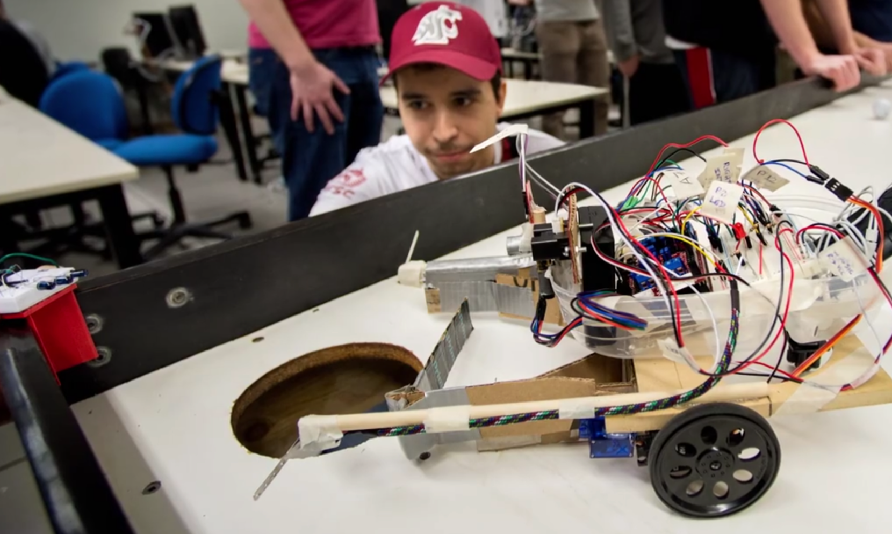

### Welcome to my Github page! 👋

:warning: This page is still under construction! Stay tuned 😝: :warning:

### Languages and Tools:

  
  
  
  
  
  
  
  
  

### Reach me:

 
  
   

My first ever robot:

<!--
**idoria75/idoria75** is a ✨ _special_ ✨ repository because its `README.md` (this file) appears on your GitHub profile.

Here are some ideas to get you started:

- 🔭 I’m currently working on ...
- 🌱 I’m currently learning ...
- 👯 I’m looking to collaborate on ...
- 🤔 I’m looking for help with ...
- 💬 Ask me about ...
- 📫 How to reach me: ...
- 😄 Pronouns: ...
- ⚡ Fun fact: ...
-->
