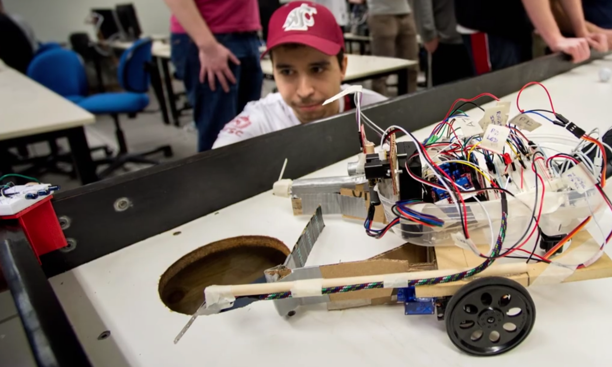
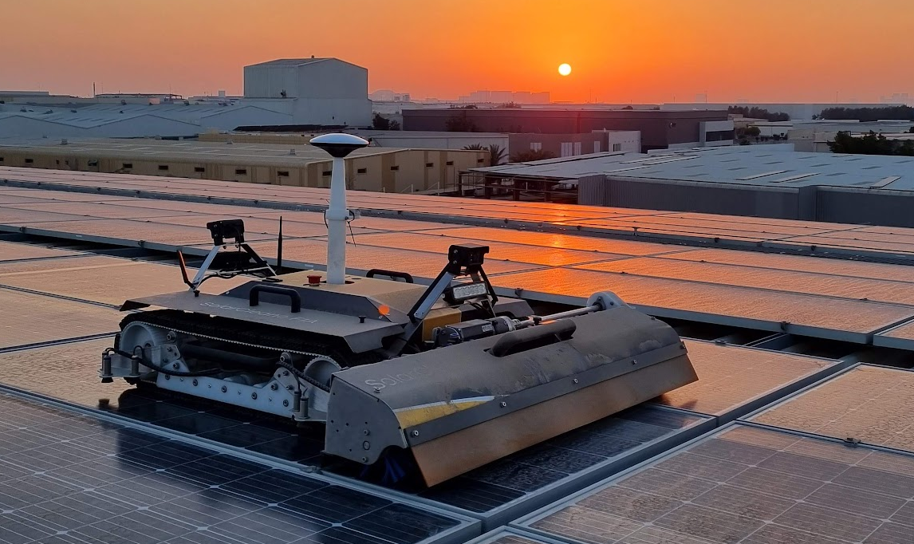

# Hey 👋, I'm Ivan!

🤖 Robotics software engineer working on mobile robots and embedded systems

🔧 I build robot software with **ROS, C++ and Python**.

🌱 Currently exploring **React/JavaScript** for robot dashboards and web-based teleoperation

## 🚀 Things I've built

- **[4Legged_SpiderBot](https://github.com/idoria75/4Legged_SpiderBot)** — Quadruped robot with custom gait control (C++, Arduino)
- **[smart_house](https://github.com/idoria75/smart_house)** — ESP32 and Raspberry Pi wireless sensor network to monitor home conditions
- **[ros2-gst-test](https://github.com/idoria75/ros2-gst-test)** — Integration between ROS 2 and GStreamer for robot video streaming (C++)

## 🛠️ Languages and Tools

### 🤖 Robotics

### 💻 Languages

### 🧰 Tools

## 📊 Stats

## 🤖 My first robot vs. my latest one

| First robot (2016) | Latest robot (2026) |
|:---:|:---:|
|  |  |

It's a marathon, not a race :)

## 📫 Reach me

